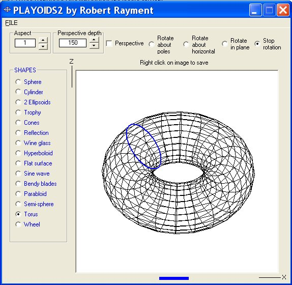



## PlayOids2\(Update2\)

### Description

PlayOids2 by Robert Rayment. (2nd update, move shape to mouse click point) (Quick update to rotate in plane). Just a bit of maths play for those who like that kind of thing. Demonstrates rotatable wireframe spheres, ellipsoids,cylinders etc with and without perspective. Aspect ratio, perspective distance and animation variable on the fly and save as bmp. Zip 9 KB.
 
### More Info
 
Just run

             |
---                |---
**Submitted On**   |2004-05-29 09:58:12
**By**             |[Robert Rayment](https://github.com/Planet-Source-Code/PSCIndex/blob/master/ByAuthor/robert-rayment.md)
**Level**          |Beginner
**User Rating**    |5.0 (40 globes from 8 users)
**Compatibility**  |VB 6\.0
**Category**       |[Graphics](https://github.com/Planet-Source-Code/PSCIndex/blob/master/ByCategory/graphics__1-46.md)
**World**          |[Visual Basic](https://github.com/Planet-Source-Code/PSCIndex/blob/master/ByWorld/visual-basic.md)
**Archive File**   |[PlayOids2\(175302632004\.zip](https://github.com/Planet-Source-Code/robert-rayment-playoids2-update2__1-54095/archive/master.zip)

### API Declarations

LineTo & MoveToEx apart form dialog class

